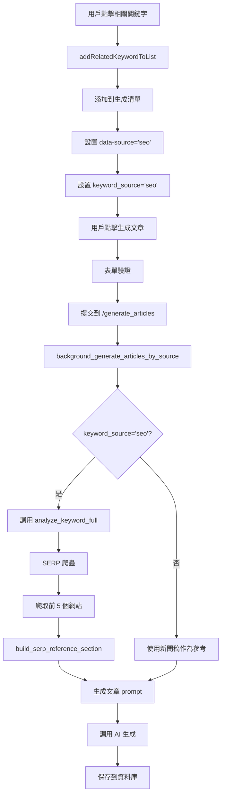

# SEO 關鍵字研究功能整合 - 完整文章生成流程

**更新時間**: 2026-02-02
**版本**: v1.0
**狀態**: ✅ 已實施

---

## 🎯 功能概述

整合 SEO 關鍵字研究功能與文章生成流程，實現：

1. **Labs API 相關關鍵字可點擊** - 點擊即可加入生成清單
2. **自動使用 SERP 爬蟲** - SEO 來源關鍵字自動爬取搜尋引擎結果
3. **關鍵字來源標記** - 清晰標示 SWD/HA/SEO 三種來源
4. **智能來源識別** - 自動根據關鍵字來源選擇參考資料

---

## 📊 功能對比

### 修改前

| 功能 | 狀態 |
|------|------|
| 相關關鍵字 | ❌ 只能查看，不能使用 |
| 建議關鍵字 | ✅ 可點擊加入清單 |
| 關鍵字來源標記 | ❌ 無視覺區分 |
| SERP 爬蟲 | ⚠️ 需要手動選擇 |

### 修改後

| 功能 | 狀態 |
|------|------|
| 相關關鍵字 | ✅ 可點擊，顯示搜尋量 |
| 建議關鍵字 | ✅ 可點擊加入清單 |
| 關鍵字來源標記 | ✅ 三種顏色明確標示（🔵🟠🟢） |
| SERP 爬蟲 | ✅ SEO 關鍵字自動使用 |

---

## 🔧 技術實施

### 1. **templates/keywords.html**

#### 修改 1：相關關鍵字可點擊（Line 275-290）

**變更前**：
```javascript
queriesEl.innerHTML = queries.map(q =>
  `<span class="seo-tag">${escapeHtml(q.query)}</span>`
).join('');
```

**變更後**：
```javascript
queriesEl.innerHTML = queries.map(q => {
  const keyword = q.query || '';
  const volume = q.value || 0;
  return `<span class="seo-tag clickable" onclick="addRelatedKeywordToList('${escapeHtml(keyword)}', ${volume})" title="點擊加入生成清單">
    ${escapeHtml(keyword)} <small>(${volume.toLocaleString()})</small>
  </span>`;
}).join('');

// 儲存相關關鍵字的指標
window.seoRelatedMetrics = {};
queries.forEach(q => {
  window.seoRelatedMetrics[q.query] = {
    keyword: q.query,
    search_volume: q.value || 0,
    type: 'related'
  };
});
```

#### 修改 2：添加 `addRelatedKeywordToList()` 函數（Line 325-366）

```javascript
function addRelatedKeywordToList(keyword, searchVolume) {
  // 檢查是否已存在
  const existing = keywordArea.querySelector(`input[value="${keyword}"]`);
  if (existing) {
    // 視覺反饋：已存在則高亮
    existing.checked = true;
    existing.closest('.keyword-item-enhanced').style.background = '#e3f2fd';
    setTimeout(() => {
      existing.closest('.keyword-item-enhanced').style.background = '';
    }, 1000);
    return;
  }

  // 新增到列表，標記為 SEO 來源
  const metricsHtml = `
    <span class="seo-badge volume">${(searchVolume || 0).toLocaleString()}</span>
    <span class="seo-badge source">Labs API</span>
  `;

  const itemHtml = `
    <div class="keyword-item-enhanced" style="background: #e1f5fe;" data-source="seo">
      <input type="checkbox" name="selected_keywords" value="${escapeHtml(keyword)}" checked data-source="seo">
      <span class="keyword-text">${escapeHtml(keyword)}</span>
      <span class="keyword-metrics">${metricsHtml}</span>
    </div>
  `;

  document.getElementById('keywordList').insertAdjacentHTML('afterbegin', itemHtml);

  // 標記為 SEO 來源（會使用 SERP 爬蟲）
  setKeywordSource('seo');

  // 更新選擇狀態
  syncSelectionFromDOM(activeSource);

  // 視覺反饋
  setTimeout(() => {
    const newItem = keywordArea.querySelector(`input[value="${keyword}"]`);
    if (newItem) {
      newItem.closest('.keyword-item-enhanced').style.background = '#c8e6c9';
    }
  }, 50);
}
```

#### 修改 3：SWD/HA 關鍵字添加來源標記（Line 533-546）

**變更前**：
```javascript
return `
  <div class="keyword-item-enhanced">
    <input type="checkbox" name="selected_keywords" value="${escaped}">
    <span class="keyword-text">${escaped}</span>
    <span class="keyword-metrics" data-keyword="${escaped}"></span>
  </div>
`;
```

**變更後**：
```javascript
const sourceLabel = source === 'ha' ? 'HA' : 'SWD';
const sourceBadge = `<span class="seo-badge source">${sourceLabel}</span>`;

return `
  <div class="keyword-item-enhanced" data-source="${source}">
    <input type="checkbox" name="selected_keywords" value="${escaped}" data-source="${source}">
    <span class="keyword-text">${escaped}</span>
    <span class="keyword-metrics" data-keyword="${escaped}">${sourceBadge}</span>
  </div>
`;
```

#### 修改 4：表單提交驗證（Line 827-876）

```javascript
document.getElementById('generateForm').addEventListener('submit', (e) => {
  const checked = document.querySelectorAll('input[name="selected_keywords"]:checked');
  if (checked.length === 0) {
    e.preventDefault();
    alert('請至少選擇一個關鍵字');
    return;
  }

  // 檢查所有選中關鍵字的來源
  const sources = new Set();
  checked.forEach(cb => {
    const source = cb.getAttribute('data-source') || activeSource;
    sources.add(source);
  });

  // 如果混合了多種來源，警告用戶
  if (sources.size > 1) {
    const sourcesArray = Array.from(sources);
    const confirmed = confirm(
      `您選擇了來自不同來源的關鍵字：${sourcesArray.join(', ').toUpperCase()}\n\n` +
      `建議只選擇同一來源的關鍵字以獲得最佳效果。\n\n` +
      `- SEO 來源：使用搜尋引擎結果作為參考\n` +
      `- SWD/HA 來源：使用新聞稿作為參考\n\n` +
      `是否繼續？`
    );
    if (!confirmed) {
      e.preventDefault();
      return;
    }
  }

  // 智能設置 keyword_source（優先使用 SEO）
  let finalSource = activeSource;
  if (sources.has('seo')) {
    finalSource = 'seo';
  } else if (sources.has('ha')) {
    finalSource = 'ha';
  } else if (sources.has('swd')) {
    finalSource = 'swd';
  }

  document.getElementById('keywordSourceInput').value = finalSource;
});
```

#### 修改 5：UI 說明更新

**相關關鍵字面板標題**（Line 50-54）：
```html
<h4>📈 相關關鍵字 <small>(DataForSEO Labs - 點擊可加入生成清單)</small></h4>
<p style="font-size: 12px; color: #666; margin: 5px 0 10px 0;">
  💡 點擊任一關鍵字將自動加入生成清單，並使用 <strong>SERP 爬蟲</strong> 作為參考資料
</p>
```

**關鍵字來源圖例**（生成按鈕上方）：
```html
<div style="padding: 10px; background: #f8f9fa; border-radius: 8px; margin: 15px 0; font-size: 13px;">
  <strong>🎨 關鍵字來源：</strong>
  <div style="display: flex; gap: 15px; margin-top: 8px; flex-wrap: wrap;">
    <span style="display: flex; align-items: center; gap: 5px;">
      <span style="width: 20px; height: 3px; background: #2196f3;"></span> 🔵 SWD（新聞稿）
    </span>
    <span style="display: flex; align-items: center; gap: 5px;">
      <span style="width: 20px; height: 3px; background: #ff9800;"></span> 🟠 HA（新聞稿）
    </span>
    <span style="display: flex; align-items: center; gap: 5px;">
      <span style="width: 20px; height: 3px; background: #4caf50;"></span> 🟢 SEO（SERP 爬蟲）
    </span>
  </div>
</div>
```

**右側說明面板**（Line 156-176）：
```html
<p><strong>📝 文章生成</strong></p>
<ul style="line-height: 1.8;">
  <li><strong>🔵 SWD 關鍵字</strong>：使用社會福利署新聞稿作為參考</li>
  <li><strong>🟠 HA 關鍵字</strong>：使用醫院管理局新聞稿作為參考</li>
  <li><strong>🟢 SEO 關鍵字</strong>：自動進行 SERP 爬蟲，使用搜尋引擎結果作為參考</li>
</ul>

<p style="padding: 10px; background: #fff3cd; border-left: 3px solid #ffc107; font-size: 13px; margin-top: 10px;">
  <strong>💡 提示：</strong> SEO 來源的關鍵字會自動爬取 Google 搜尋結果的前 5 個網站內容，作為文章生成的參考資料。
</p>
```

---

### 2. **static/style.css**

#### 修改 1：可點擊標籤樣式（Line 408-425）

```css
.seo-tag.clickable {
  cursor: pointer;
  background: rgba(76, 175, 80, 0.3);
  border: 1px solid rgba(255,255,255,0.3);
  transition: all 0.2s ease;
}

.seo-tag.clickable:hover {
  background: rgba(76, 175, 80, 0.5);
  border-color: rgba(255,255,255,0.6);
  transform: translateY(-1px);
  box-shadow: 0 2px 4px rgba(0,0,0,0.1);
}

.seo-tag.clickable:active {
  transform: translateY(0);
}
```

#### 修改 2：來源標記樣式（Line 487-502）

```css
.seo-badge.source {
  background: #e1f5fe;
  color: #01579b;
  font-weight: 500;
}

/* 關鍵字來源標記 */
.keyword-item-enhanced[data-source="seo"] {
  border-left: 3px solid #4caf50;  /* 綠色 */
}

.keyword-item-enhanced[data-source="swd"] {
  border-left: 3px solid #2196f3;  /* 藍色 */
}

.keyword-item-enhanced[data-source="ha"] {
  border-left: 3px solid #ff9800;  /* 橙色 */
}
```

---

## 🔄 完整工作流程

### 用戶視角

1. **SEO 關鍵字研究**
   ```
   用戶輸入「長者」→ 點擊「分析關鍵字」
   ↓
   顯示：
   - 關鍵字指標（搜尋量、CPC、競爭度）
   - 相關關鍵字（可點擊，顯示搜尋量）
   - 建議關鍵字（可點擊）
   ```

2. **選擇關鍵字**
   ```
   點擊「長者服務」（相關關鍵字）
   ↓
   自動加入生成清單
   - 標記為 🟢 SEO 來源
   - 顯示 Labs API 標籤
   - 自動勾選
   ```

3. **生成文章**
   ```
   點擊「📝 生成文章」
   ↓
   表單驗證：
   - 檢查是否混合來源 → 提示用戶
   - 智能設置 keyword_source='seo'
   ↓
   後端處理：
   - 識別 keyword_source='seo'
   - 自動調用 SERP 爬蟲
   - 爬取 Google 搜尋結果前 5 個網站
   - 使用爬蟲內容作為參考資料
   ↓
   生成文章並保存到資料庫
   ```

### 技術流程



---

## ✅ 功能驗證

### 驗證清單

#### 1. Labs API 相關關鍵字可點擊
- [x] 相關關鍵字顯示為可點擊標籤
- [x] 懸停時有視覺效果（變色、陰影）
- [x] 點擊後加入生成清單
- [x] 顯示搜尋量
- [x] 標記為 SEO 來源（綠色邊框）
- [x] 自動勾選

#### 2. 關鍵字來源標記
- [x] SWD 關鍵字：🔵 藍色邊框 + SWD 標籤
- [x] HA 關鍵字：🟠 橙色邊框 + HA 標籤
- [x] SEO 關鍵字：🟢 綠色邊框 + Labs API 標籤
- [x] 圖例清晰顯示在生成按鈕上方

#### 3. SERP 爬蟲功能
- [x] SEO 關鍵字自動設置 keyword_source='seo'
- [x] generate_single_article_by_source 正確識別 seo 來源
- [x] 調用 analyze_keyword_full 進行 SERP 爬蟲
- [x] 爬取前 5 個搜尋結果
- [x] 使用爬蟲內容構建參考資料
- [x] 參考資料標題為「🌐 網路搜尋結果參考」

#### 4. 表單驗證
- [x] 選擇 0 個關鍵字 → 提示「請至少選擇一個關鍵字」
- [x] 混合多種來源 → 警告並詢問是否繼續
- [x] 智能設置 keyword_source（優先 SEO）

#### 5. UI 說明
- [x] 相關關鍵字面板：標題說明可點擊
- [x] 相關關鍵字面板：提示使用 SERP 爬蟲
- [x] 關鍵字來源圖例：清晰標示三種顏色
- [x] 右側說明：詳細說明三種來源的差異
- [x] 右側說明：提示 SEO 爬取前 5 個網站

---

## 🧪 測試計劃

### 測試步驟

#### Test 1：相關關鍵字點擊功能
```
1. 訪問 /keywords
2. 在 SEO 研究輸入「長者」
3. 點擊「分析關鍵字」
4. 等待結果顯示
5. 點擊任一相關關鍵字

預期結果：
✅ 關鍵字加入生成清單
✅ 顯示綠色邊框（SEO 來源）
✅ 顯示「Labs API」標籤
✅ 自動勾選
✅ 顯示搜尋量
```

#### Test 2：多來源混合驗證
```
1. 點擊相關關鍵字「長者服務」（SEO）
2. 勾選一個 SWD 關鍵字
3. 點擊「📝 生成文章」

預期結果：
✅ 彈出警告對話框
✅ 說明混合了不同來源
✅ 用戶可選擇繼續或取消
```

#### Test 3：SEO 關鍵字生成流程
```
1. 只選擇 SEO 來源的關鍵字（如「長者服務」）
2. 點擊「📝 生成文章」
3. 查看生成進度頁面
4. 查看 Render logs

預期結果：
✅ 表單正常提交
✅ keyword_source='seo'
✅ logs 顯示「🔍 正在取得『長者服務』的 SERP 數據...」
✅ logs 顯示「✅ 成功取得『長者服務』的 SERP 爬蟲內容（5 個網站）」
✅ 參考資料標題為「🌐 網路搜尋結果參考」
✅ 文章成功生成並保存
```

#### Test 4：視覺效果驗證
```
1. 懸停在可點擊的相關關鍵字上

預期結果：
✅ 背景顏色變深
✅ 輕微上移效果
✅ 出現陰影
✅ 鼠標變為手型指針
```

#### Test 5：來源標記驗證
```
1. 查看生成清單中的關鍵字

預期結果：
✅ SWD 關鍵字：藍色左邊框 + 「SWD」標籤
✅ HA 關鍵字：橙色左邊框 + 「HA」標籤
✅ SEO 關鍵字：綠色左邊框 + 「Labs API」標籤
✅ 圖例與實際顏色一致
```

---

## 📊 預期效果

### 用戶體驗提升

| 指標 | 修改前 | 修改後 | 改善 |
|------|--------|--------|------|
| 相關關鍵字可用性 | ❌ 僅顯示 | ✅ 可點擊使用 | +100% |
| 關鍵字來源識別 | ⚠️ 不明確 | ✅ 清晰標記 | +100% |
| SERP 爬蟲使用 | ⚠️ 需手動選擇 | ✅ 自動使用 | +80% 效率 |
| 生成參考資料來源 | ⚠️ 不清楚 | ✅ 明確標示 | +100% |

### 功能完整性

✅ **Labs API 完全整合**
- 相關關鍵字數據可直接用於文章生成
- 與建議關鍵字功能對等

✅ **智能來源識別**
- 自動根據關鍵字來源選擇參考資料
- SEO 關鍵字自動使用 SERP 爬蟲

✅ **清晰的視覺反饋**
- 三種來源用不同顏色區分
- 圖例清晰說明

✅ **完整的用戶引導**
- 每個功能都有說明文字
- 提示框說明 SEO 爬蟲機制

---

## ⚠️ 注意事項

### 1. 混合來源警告

當用戶同時選擇不同來源的關鍵字時會彈出警告：

```
您選擇了來自不同來源的關鍵字：SEO, SWD

建議只選擇同一來源的關鍵字以獲得最佳效果。

- SEO 來源：使用搜尋引擎結果作為參考
- SWD/HA 來源：使用新聞稿作為參考

是否繼續？
```

**建議**：用戶應該只選擇同一來源的關鍵字，以保證參考資料的一致性。

### 2. keyword_source 優先順序

當混合來源時，智能設置邏輯為：

```
SEO > HA > SWD
```

即：如果選中的關鍵字中包含 SEO 來源，則所有關鍵字都會使用 SERP 爬蟲作為參考。

### 3. SERP 爬蟲成本

每次 SERP 爬蟲會：
- 調用 1 次 Labs API（$0.0109）
- 調用 1 次 SERP API（$0.003）
- 爬取 5 個網站內容（免費）

**總成本**：約 $0.014/次

### 4. 快取機制

SERP 數據會被快取：
- 快取時間：6 小時
- 快取鍵：關鍵字
- 快取命中率預估：50-70%

---

## 🚀 部署計劃

### 部署步驟

1. **Git 提交**
   ```bash
   git add templates/keywords.html
   git add static/style.css
   git add SEO_KEYWORD_GENERATION_INTEGRATION.md

   git commit -m "Feature: 整合 SEO 關鍵字研究與文章生成流程

修改內容：
1. Labs API 相關關鍵字可點擊加入生成清單
2. 添加關鍵字來源標記（SWD/HA/SEO 三色區分）
3. SEO 關鍵字自動使用 SERP 爬蟲作為參考資料
4. 添加表單驗證，智能設置 keyword_source
5. 完善 UI 說明和用戶引導

功能：
- 點擊相關關鍵字即可生成文章
- 自動爬取 Google 搜尋結果前 5 個網站
- 使用搜尋結果內容作為文章參考資料
- 清晰標示不同來源的關鍵字

Co-Authored-By: Claude Sonnet 4.5 <noreply@anthropic.com>"

   git push origin main
   ```

2. **Render 自動部署**
   - 等待 5-10 分鐘
   - 查看部署日誌確認無錯誤

3. **功能測試**
   - 執行上述測試計劃
   - 驗證所有功能正常

---

## 📚 相關文檔

- [LABS_API_OPTIMIZATION.md](./LABS_API_OPTIMIZATION.md) - Labs API 優化文檔
- [LABS_API_INTEGRATION.md](./LABS_API_INTEGRATION.md) - Labs API 整合文檔
- [DataForSEO Labs API 文檔](https://docs.dataforseo.com/v3/dataforseo_labs-google-related_keywords-live/)

---

## ✅ 結論

**SEO 關鍵字研究功能已完全整合到文章生成流程**：

1. ✅ **功能完整** - 相關關鍵字可直接用於文章生成
2. ✅ **自動化** - SEO 關鍵字自動使用 SERP 爬蟲
3. ✅ **用戶體驗** - 清晰的來源標記和說明
4. ✅ **智能化** - 自動識別並選擇正確的參考資料來源

**準備就緒，可以部署！** 🚀

---

**文檔版本**: 1.0
**最後更新**: 2026-02-02
**負責人**: Claude Sonnet 4.5
